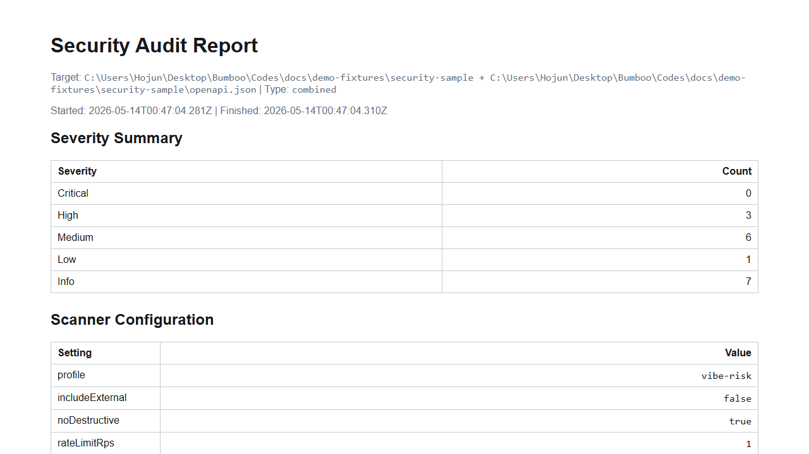
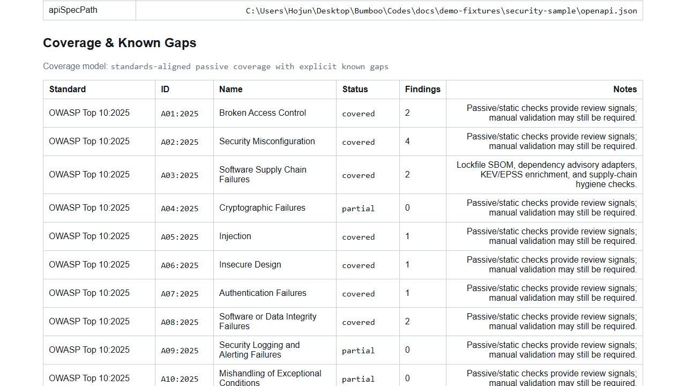

# BTS Sec

> vibe-coded 및 AI-assisted web project를 위한 passive, non-destructive defensive security auditing toolkit.

[Overview](../../README.md) | [English](README.en.md) | [한국어](README.ko.md) | [中文](README.zh-CN.md) | [日本語](README.ja.md)

BTS Sec은 vibe-coded web application, AI-assisted codebase, authorized web service를 위한 방어적 보안 감사 툴킷입니다. AI coding agent, low-code AI app builder, generated auth/database/payment flow, public-by-default deployment에서 자주 생기는 위험을 찾는 데 초점을 둡니다.

Public name은 **BTS Sec**입니다. `VibeSec`은 내부/alternate naming direction이며 아직 main public name으로 쓰지 않습니다. 호환성을 위해 `vibesec` CLI alias가 남아 있을 수 있지만, 공개 문서의 주 이름은 BTS Sec입니다.

기본값은 passive, non-destructive check입니다. log는 local에 보관하고, 감지된 secret은 redaction하며, URL scan은 authorization이 명시적으로 확인된 경우에만 허용합니다.

## Quick Start

```bash
npm install
npm run build
bts-sec scan --dir ./path/to/project --profile vibe-risk --out reports/local
bts-sec scan --api-spec ./openapi.json --out reports/api
bts-sec scan --url https://example.internal --profile vibe-risk --authorization-confirmation "I confirm I own or am authorized to test this target." --out reports/url
bts-sec scan --url https://example.internal --dir ./path/to/project --api-spec ./openapi.yaml --profile vibe-risk --authorization-confirmation "I confirm I own or am authorized to test this target." --out reports/full
```

생성되는 report:

- `report.md`
- `report.html`
- `report.json`
- `report.sarif`
- `agent-fix-prompt.md`

## Safety Model

- exploit execution, brute force, credential theft, destructive payload, data extraction routine을 구현하지 않습니다.
- URL scanning은 사용자가 제공한 exact origin으로 제한됩니다. passive crawler는 same-origin link만 따라갑니다.
- URL scanning에는 explicit authorization confirmation이 필요합니다. `--authorization-confirmation "I confirm I own or am authorized to test this target."` 사용을 권장합니다.
- built-in HTTP check는 `--rate-limit-rps`로 제한되며 기본값은 초당 1 request입니다.
- built-in web check는 `GET`, `HEAD`, `OPTIONS`만 사용합니다. form submit, authentication, state mutation, exploit payload 실행을 하지 않습니다.
- external adapter는 격리되어 있으며, tool이 없으면 전체 scan 실패가 아니라 informational adapter finding으로 보고합니다.
- external adapter는 `--include-external`이 있을 때만 실행됩니다.
- Nuclei 실행은 allowlisted template ID/path로 제한됩니다.
- TruffleHog live credential validation은 기본적으로 비활성화됩니다.
- 모든 report evidence는 출력 전에 redactor를 통과합니다. raw secret/token/body content를 저장하지 않습니다.
- package install, dependency script execution, arbitrary target code execution, destructive HTTP method, active GraphQL introspection POST는 수행하지 않습니다.

## CLI

```bash
bts-sec --target <url-or-directory> [options]
```

주요 options:

- `--target <value>` authorized URL 또는 local project directory.
- `--url <value>` `bts-sec scan`용 authorized URL target.
- `--dir <path>` `bts-sec scan`용 local project directory target.
- `--api-spec <path>` passive OpenAPI/Swagger JSON 또는 YAML specification scan.
- `--profile <baseline|vibe-risk>` scan profile. 기본값은 `baseline`.
- `--confirm-authorization` URL target에 필요.
- `--authorization-confirmation "I confirm I own or am authorized to test this target."` 권장 authorization phrase.
- `--out <dir>` output directory. 기본값은 `reports/latest`.
- `--rate-limit-rps <n>` built-in HTTP request rate limit. 기본값은 `1`.
- `--timeout-ms <n>` per-request 및 adapter timeout. 기본값은 `15000`.
- `--max-crawl-depth <n>` same-origin passive crawler depth. 기본값은 `1`.
- `--max-crawl-pages <n>` same-origin passive crawler page cap. 기본값은 `25`.
- `--include-external` installed external tool adapter 실행.
- `--kev-catalog <path>` CVE enrichment용 local CISA KEV JSON catalog.
- `--refresh-kev` public CISA KEV JSON feed fetch.
- `--epss-csv <path>` CVE enrichment용 local FIRST EPSS CSV.
- `--refresh-epss` reported CVE에 대해 FIRST EPSS API data fetch.
- `--nuclei-template <path-or-id>` allowlisted Nuclei template. 반복 가능.

## Module Layout

- `scanner-core`: target validation, orchestration, task runner, finding schema, scoring, aggregation.
- `api-scanner`: authentication, authorization, inventory, SSRF, mass assignment, resource-consumption hint를 위한 passive OpenAPI/Swagger static check.
- `web-scanner`: safe header, cookie, CORS, exposure check, same-origin passive crawler, GraphQL static hint, ZAP Baseline/Nuclei adapter.
- `code-scanner`: custom static rule, multiline matching, standards mapping, suppress comment, Semgrep adapter.
- `dependency-scanner`: lockfile-based SBOM, supply-chain hygiene check, Trivy, OSV-Scanner, npm audit, pip-audit.
- `secret-scanner`: internal redaction, Gitleaks, TruffleHog adapter.
- `knowledge-base`: OWASP, OWASP API, MITRE CWE Top 25, CISA KEV enrichment, remediation guidance.
- `report-generator`: Markdown, HTML, JSON, SARIF report.
- `vibe-scanner`: AI agent artifact, dependency hallucination/slopsquatting, auth/payment/database static review, public URL exposure, pre-agent-run checklist용 vibe-risk profile scanner.

## Vibe-Risk Profile

`--profile vibe-risk`는 다음 위험에 대한 deterministic, non-destructive check를 추가합니다.

- dashboard, admin, customer, support, internal page의 public exposure.
- client-side-only 또는 missing server-side auth check.
- ownership, role, user, tenant, account authorization boundary 누락.
- Stripe webhook signature verification 및 client-only payment success handling 문제.
- Supabase RLS와 Firebase open rule risk.
- public Supabase, Firebase, Clerk, Stripe, OpenAI, Resend configuration risk.
- `.cursor/rules`, `.cursorrules`, `CLAUDE.md`, `AGENTS.md`, `GEMINI.md`, `.windsurfrules`, `.cline/`, `.roo/`, MCP config 등 AI coding assistant artifact.
- dependency hallucination, import/manifest mismatch, typosquatting-like name, registry metadata가 있을 때 suspiciously new package, install script risk.
- Vercel, Netlify, Replit, Lovable, Base44, Bolt, v0, Cursor-generated project 등 platform hint.
- sensitive raw content를 저장하지 않고 PII, medical, financial, customer conversation, credential, internal-business exposure indicator를 감지.

## Report Schema

Finding은 severity, confidence, category, target type, redacted evidence, optional vibe-risk metadata, OWASP Top 10:2025, OWASP LLM Top 10:2025, OWASP API Top 10:2023, CWE Top 25:2025, CISA KEV priority, remediation guidance, verification steps, Codex-ready remediation prompt를 포함하는 normalized schema를 사용합니다.

Markdown, HTML, JSON, SARIF report는 `Coverage & Known Gaps` matrix, standard item별 `covered` / `partial` / `not_covered` status, scanner configuration summary, suppressed finding summary, priority score, KEV/EPSS fields, dependency direct/transitive context를 포함합니다.

coverage model은 **standards-aligned passive coverage with explicit known gaps**입니다. `covered`는 해당 standard item에 대한 first-class passive/static check 또는 enrichment path가 있다는 뜻입니다. `partial`은 review signal은 만들 수 있지만 weakness의 부재나 exploitability를 증명하지 않는다는 뜻입니다. `not_covered`는 dedicated SAST/compiler/runtime analysis 또는 active authorized testing이 필요한 경우처럼 의도적으로 built-in detection을 구현하지 않았다는 뜻입니다.

## OpenAPI/API Scanning

`--api-spec <openapi-json-or-yaml>`은 OpenAPI/Swagger spec을 local에서 읽고 다음 항목을 passive/static으로 확인합니다.

- global 또는 operation-level security requirement 누락.
- BOLA review가 필요해 보이는 object-id endpoint.
- admin/internal/function-level authorization sensitive path.
- request schema의 object property exposure 및 mass assignment risk.
- SSRF risk를 시사하는 user-controlled URL field.
- collection endpoint의 pagination/rate-limit hint 누락.
- deprecated 또는 undocumented-looking endpoint.

API scanner는 request를 보내지 않습니다. URL target이 함께 제공되더라도 web check는 same-origin 및 non-destructive로 유지됩니다.

## Dependency, SBOM, and Supply Chain

SBOM generation은 package install 없이 manifest와 lockfile을 읽습니다. 지원 input은 `package.json`, `package-lock.json`, `pnpm-lock.yaml`, `yarn.lock`, `requirements.txt`, `Pipfile.lock`, `poetry.lock`, `go.sum`, `Cargo.lock`, `pom.xml`, `build.gradle`, `gradle.lockfile`입니다.

Supply-chain hygiene check는 static이며 OWASP SCVS 정신에 맞춰져 있습니다. missing lockfile, package-manager mismatch, unpinned dependency, git/URL dependency, lifecycle install script, suspicious internal-looking namespace, dependency-confusion candidate를 표시합니다. BTS Sec는 package install이나 arbitrary package script를 실행하지 않습니다.

CVE finding은 local catalog가 제공되거나 refresh flag가 명시적으로 사용된 경우에만 CISA KEV와 FIRST EPSS로 enrich됩니다. Priority score는 severity, KEV presence, EPSS percentile, fix availability, direct/transitive dependency context를 조합합니다.

## Pre-Agent-Run Checklist

BTS Sec은 report에 다음 위험을 경고하는 section을 추가합니다.

- dirty git working tree.
- missing commit.
- missing lockfile.
- missing test 또는 auth/payment/database test.
- risky package lifecycle script.
- vibe-risk profile에서 찾은 AI rule 및 MCP configuration risk.

`git status`, `git diff`, `npm test`, `pnpm test`, `pytest` 같은 command는 suggestion일 뿐입니다. BTS Sec은 project test script나 arbitrary target code를 실행하지 않습니다.

## Agent Fix Prompts

각 scan은 Codex 또는 다른 AI coding agent에 붙여 넣을 수 있는 English prompt인 `agent-fix-prompt.md`도 작성합니다. prompt에는 actionable finding, redacted evidence, recommended fix, verification step, exploit execution, credential validation, brute force, destructive payload, out-of-scope scanning을 금지하는 safety instruction이 포함됩니다.

같은 text는 automation을 위해 `report.json`의 `agentFixPrompt`에도 포함됩니다.

## Adding Rules

- vibe-coded 또는 AI-agent workflow에 특화된 rule은 `src/vibe-scanner/*`에 추가합니다.
- generic web URL check는 `src/web-scanner/*`, vibe-specific URL check는 `src/vibe-scanner/url-vibe-scanner.ts`에 추가합니다.
- mapping default는 `src/knowledge-base/mappings.ts`에 추가합니다.
- 여러 rule이 재사용할 remediation text는 `src/knowledge-base/remediation.ts`에 추가합니다.
- test는 temporary fixture project를 사용해 `tests/` 아래에 추가합니다. Rule은 deterministic해야 하며, test가 명시적으로 mock하지 않는 한 network access를 피해야 합니다.

## Known Limitations

- toolkit은 static/passive/heuristic입니다. review할 risky pattern을 표시하지만 exploitability나 vulnerability 부재를 증명하지 않습니다.
- suspicious dependency age는 supplied registry metadata를 사용하며 paid API를 호출하지 않습니다.
- typosquatting detection은 의도적으로 보수적이며 manual review가 필요합니다.
- URL check는 form submit, authentication, third-party link crawling, state mutation, GraphQL introspection POST, bypass attempt를 하지 않습니다.
- auth/payment/database analysis는 framework-pattern 기반이라 custom abstraction을 놓칠 수 있습니다.
- memory-safety CWE는 built-in passive scanner 밖의 dedicated tooling이 필요합니다.
- YAML OpenAPI parsing에는 conservative fallback이 있으며 JSON 또는 fully parsed OpenAPI object가 더 풍부한 schema analysis를 제공합니다.

## Demo Walkthrough

demo flow는 local sample project와 OpenAPI file을 scan한 뒤 generated HTML report에서 coverage와 finding을 검토합니다.

1. `npm install`을 실행합니다.
2. `npm run build`를 실행합니다.
3. 소유하거나 감사 권한이 있는 local project를 `npm run scan -- scan --dir "<project-path>" --profile vibe-risk --out reports/local`로 scan합니다.
4. OpenAPI file이 있으면 `--api-spec "<openapi-path>"`를 포함합니다.
5. browser에서 `reports\local\report.html`을 열고 `Coverage & Known Gaps`와 `Findings`를 검토합니다.

report 상단에는 scan target, run time, severity summary, scanner configuration이 표시됩니다.



`Coverage & Known Gaps`와 `Findings`로 내려가 어떤 check가 실행되었고 무엇이 보고되었는지 확인합니다.


